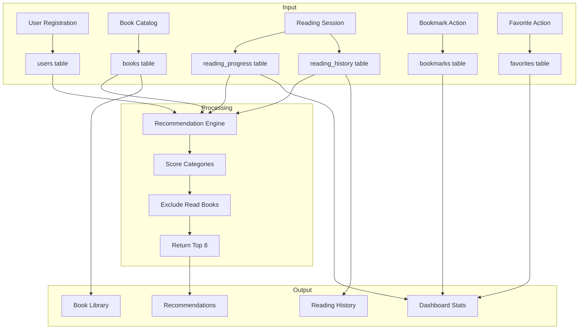

# LEARNOVA - Entity Relationship Diagram

## 1. ER Diagram

```mermaid
erDiagram
    users {
        INT UNSIGNED id PK "AUTO_INCREMENT"
        VARCHAR(80) name "NOT NULL"
        VARCHAR(80) surname "NOT NULL"
        VARCHAR(190) email "UNIQUE, NOT NULL"
        VARCHAR(255) password_hash "NOT NULL"
        VARCHAR(24) membership_id "UNIQUE, NOT NULL"
        DATE dob "NULLABLE"
        VARCHAR(500) profile_picture "NULLABLE"
        JSON interests "NULLABLE"
        TIMESTAMP created_at "DEFAULT CURRENT_TIMESTAMP"
    }

    books {
        INT UNSIGNED id PK "AUTO_INCREMENT"
        VARCHAR(255) title "NOT NULL"
        VARCHAR(255) author "NOT NULL"
        VARCHAR(500) cover "NULLABLE"
        TEXT description "NULLABLE"
        VARCHAR(100) category "NULLABLE"
        INT UNSIGNED page_count "DEFAULT 0"
        VARCHAR(40) isbn "UNIQUE, NULLABLE"
        DECIMAL(3,1) rating "NULLABLE"
        VARCHAR(50) language "DEFAULT 'English'"
        VARCHAR(50) level "NULLABLE"
        TIMESTAMP added_at "DEFAULT CURRENT_TIMESTAMP"
    }

    reading_progress {
        INT UNSIGNED id PK "AUTO_INCREMENT"
        INT UNSIGNED user_id FK "NOT NULL"
        INT UNSIGNED book_id FK "NOT NULL"
        INT UNSIGNED current_page "DEFAULT 0"
        ENUM status "reading, completed, paused"
        INT UNSIGNED reading_time_minutes "DEFAULT 0"
        VARCHAR(255) last_position "NULLABLE"
        TIMESTAMP last_read_at "DEFAULT CURRENT_TIMESTAMP"
        TIMESTAMP started_at "DEFAULT CURRENT_TIMESTAMP"
        TIMESTAMP completed_at "NULLABLE"
    }

    reading_history {
        INT UNSIGNED id PK "AUTO_INCREMENT"
        INT UNSIGNED user_id FK "NOT NULL"
        INT UNSIGNED book_id FK "NOT NULL"
        ENUM action "viewed, opened, completed, bookmarked, favorited"
        TIMESTAMP viewed_at "DEFAULT CURRENT_TIMESTAMP"
    }

    bookmarks {
        INT UNSIGNED id PK "AUTO_INCREMENT"
        INT UNSIGNED user_id FK "NOT NULL"
        INT UNSIGNED book_id FK "NOT NULL"
        TIMESTAMP created_at "DEFAULT CURRENT_TIMESTAMP"
    }

    favorites {
        INT UNSIGNED id PK "AUTO_INCREMENT"
        INT UNSIGNED user_id FK "NOT NULL"
        INT UNSIGNED book_id FK "NOT NULL"
        TIMESTAMP created_at "DEFAULT CURRENT_TIMESTAMP"
    }

    users ||--o{ reading_progress : "has"
    users ||--o{ reading_history : "logs"
    users ||--o{ bookmarks : "saves"
    users ||--o{ favorites : "marks"

    books ||--o{ reading_progress : "tracked in"
    books ||--o{ reading_history : "logged in"
    books ||--o{ bookmarks : "bookmarked in"
    books ||--o{ favorites : "favorited in"

    reading_progress }|--|| books : "references"
    reading_history }|--|| books : "references"
    bookmarks }|--|| books : "references"
    favorites }|--|| books : "references"
```

---

## 2. Table Relationships

### 2.1 Relationship Matrix

| Table 1 | Table 2 | Relationship | Cardinality | FK Column | ON DELETE |
|---------|---------|-------------|-------------|-----------|-----------|
| users | reading_progress | One-to-Many | 1:N | user_id | CASCADE |
| users | reading_history | One-to-Many | 1:N | user_id | CASCADE |
| users | bookmarks | One-to-Many | 1:N | user_id | CASCADE |
| users | favorites | One-to-Many | 1:N | user_id | CASCADE |
| books | reading_progress | One-to-Many | 1:N | book_id | CASCADE |
| books | reading_history | One-to-Many | 1:N | book_id | CASCADE |
| books | bookmarks | One-to-Many | 1:N | book_id | CASCADE |
| books | favorites | One-to-Many | 1:N | book_id | CASCADE |

### 2.2 Junction Tables

| Junction Table | Links | Unique Constraint | Purpose |
|---------------|-------|-------------------|---------|
| reading_progress | users + books | (user_id, book_id) | One progress record per user-book pair |
| reading_history | users + books | None (append-only) | Event log of all reading actions |
| bookmarks | users + books | (user_id, book_id) | One bookmark per user-book pair |
| favorites | users + books | (user_id, book_id) | One favorite per user-book pair |

---

## 3. Entity Descriptions

### 3.1 users

The central entity storing registered user accounts.

| Attribute | Type | Constraints | Description |
|-----------|------|-------------|-------------|
| id | INT UNSIGNED | PK, AUTO_INCREMENT | Unique user identifier |
| name | VARCHAR(80) | NOT NULL | User's first name |
| surname | VARCHAR(80) | NOT NULL | User's last name |
| email | VARCHAR(190) | UNIQUE, NOT NULL | Login email (college domain required) |
| password_hash | VARCHAR(255) | NOT NULL | bcrypt hashed password |
| membership_id | VARCHAR(24) | UNIQUE, NOT NULL | Format: LRN-YYYY-XXXXXX |
| dob | DATE | NULLABLE | Date of birth |
| profile_picture | VARCHAR(500) | NULLABLE | URL to profile image |
| interests | JSON | NULLABLE | Array of category strings |
| created_at | TIMESTAMP | DEFAULT NOW | Account creation timestamp |

### 3.2 books

The book catalog available in the library.

| Attribute | Type | Constraints | Description |
|-----------|------|-------------|-------------|
| id | INT UNSIGNED | PK, AUTO_INCREMENT | Unique book identifier |
| title | VARCHAR(255) | NOT NULL | Book title |
| author | VARCHAR(255) | NOT NULL | Author name |
| cover | VARCHAR(500) | NULLABLE | Cover image URL |
| description | TEXT | NULLABLE | Book summary |
| category | VARCHAR(100) | NULLABLE | One of 8 categories |
| page_count | INT UNSIGNED | DEFAULT 0 | Total pages |
| isbn | VARCHAR(40) | UNIQUE, NULLABLE | ISBN identifier |
| rating | DECIMAL(3,1) | NULLABLE | Rating 0.0-9.9 |
| language | VARCHAR(50) | DEFAULT 'English' | Book language |
| level | VARCHAR(50) | NULLABLE | Beginner/Intermediate/Advanced |
| added_at | TIMESTAMP | DEFAULT NOW | When book was added |

### 3.3 reading_progress

Tracks each user's progress on books they're reading.

| Attribute | Type | Constraints | Description |
|-----------|------|-------------|-------------|
| id | INT UNSIGNED | PK, AUTO_INCREMENT | Unique record identifier |
| user_id | INT UNSIGNED | FK -> users(id) | Reference to user |
| book_id | INT UNSIGNED | FK -> books(id) | Reference to book |
| current_page | INT UNSIGNED | DEFAULT 0 | Last read page |
| status | ENUM | NOT NULL | reading/completed/paused |
| reading_time_minutes | INT UNSIGNED | DEFAULT 0 | Cumulative reading time |
| last_position | VARCHAR(255) | NULLABLE | Bookmark position |
| last_read_at | TIMESTAMP | DEFAULT NOW | Last reading session |
| started_at | TIMESTAMP | DEFAULT NOW | When reading started |
| completed_at | TIMESTAMP | NULLABLE | When book was finished |

### 3.4 reading_history

Append-only log of all user-book interactions.

| Attribute | Type | Constraints | Description |
|-----------|------|-------------|-------------|
| id | INT UNSIGNED | PK, AUTO_INCREMENT | Unique event identifier |
| user_id | INT UNSIGNED | FK -> users(id) | Reference to user |
| book_id | INT UNSIGNED | FK -> books(id) | Reference to book |
| action | ENUM | NOT NULL | viewed/opened/completed/bookmarked/favorited |
| viewed_at | TIMESTAMP | DEFAULT NOW | When action occurred |

### 3.5 bookmarks

Users' saved books for later reading.

| Attribute | Type | Constraints | Description |
|-----------|------|-------------|-------------|
| id | INT UNSIGNED | PK, AUTO_INCREMENT | Unique bookmark identifier |
| user_id | INT UNSIGNED | FK -> users(id) | Reference to user |
| book_id | INT UNSIGNED | FK -> books(id) | Reference to book |
| created_at | TIMESTAMP | DEFAULT NOW | When bookmark was created |

### 3.6 favorites

Users' favorite books.

| Attribute | Type | Constraints | Description |
|-----------|------|-------------|-------------|
| id | INT UNSIGNED | PK, AUTO_INCREMENT | Unique favorite identifier |
| user_id | INT UNSIGNED | FK -> users(id) | Reference to user |
| book_id | INT UNSIGNED | FK -> books(id) | Reference to book |
| created_at | TIMESTAMP | DEFAULT NOW | When favorite was created |

---

## 4. Indexes

### 4.1 Primary Keys

| Table | Primary Key |
|-------|-------------|
| users | id |
| books | id |
| reading_progress | id |
| reading_history | id |
| bookmarks | id |
| favorites | id |

### 4.2 Unique Indexes

| Table | Column(s) | Index Name |
|-------|-----------|------------|
| users | email | uq_users_email |
| users | membership_id | uq_users_membership |
| books | isbn | uq_books_isbn |
| reading_progress | user_id, book_id | uq_progress_user_book |
| bookmarks | user_id, book_id | uq_bookmark_user_book |
| favorites | user_id, book_id | uq_favorite_user_book |

### 4.3 Regular Indexes

| Table | Column(s) | Index Name | Purpose |
|-------|-----------|------------|---------|
| reading_progress | user_id, status | idx_progress_status | Filter by user and status |
| reading_history | user_id, viewed_at | idx_history_user_time | Sort history by date |

---

## 5. Seed Data Summary

### 5.1 Book Categories

| Category | Count | Examples |
|----------|-------|----------|
| Computer Science | 6 | Clean Code, Designing Data-Intensive Applications |
| Data Science | 4 | Python for Data Analysis, Hands-On Machine Learning |
| Design | 3 | The Design of Everyday Things, Don't Make Me Think |
| Business & Economics | 4 | The Lean Startup, Zero to One |
| Literature | 4 | To Kill a Mockingbird, 1984 |
| History | 3 | Sapiens, Guns Germs and Steel |
| Science | 3 | A Brief History of Time, Cosmos |
| Self-Development | 3 | Atomic Habits, Deep Work |
| **Total** | **30** | |

### 5.2 Membership ID Format

```
LRN-YYYY-XXXXXX
│    │    │
│    │    └── 6-character alphanumeric (excluding I, O, 0, 1)
│    └── Year of registration
└── Fixed prefix
```

Example: `LRN-2026-A3B7K2`

---

## 6. Database Constraints Summary

### 6.1 NOT NULL Constraints

| Table | Columns |
|-------|---------|
| users | id, name, surname, email, password_hash, membership_id |
| books | id, title, author, page_count |
| reading_progress | id, user_id, book_id, current_page, status, reading_time_minutes, last_read_at, started_at |
| reading_history | id, user_id, book_id, action, viewed_at |
| bookmarks | id, user_id, book_id, created_at |
| favorites | id, user_id, book_id, created_at |

### 6.2 Foreign Key Constraints

| Table | FK Column | References | ON DELETE |
|-------|-----------|------------|-----------|
| reading_progress | user_id | users(id) | CASCADE |
| reading_progress | book_id | books(id) | CASCADE |
| reading_history | user_id | users(id) | CASCADE |
| reading_history | book_id | books(id) | CASCADE |
| bookmarks | user_id | users(id) | CASCADE |
| bookmarks | book_id | books(id) | CASCADE |
| favorites | user_id | users(id) | CASCADE |
| favorites | book_id | books(id) | CASCADE |

### 6.3 Default Values

| Table | Column | Default |
|-------|--------|---------|
| books | page_count | 0 |
| books | language | 'English' |
| reading_progress | current_page | 0 |
| reading_progress | status | 'reading' |
| reading_progress | reading_time_minutes | 0 |
| reading_history | action | 'viewed' |

---

## 7. Data Flow Diagram


