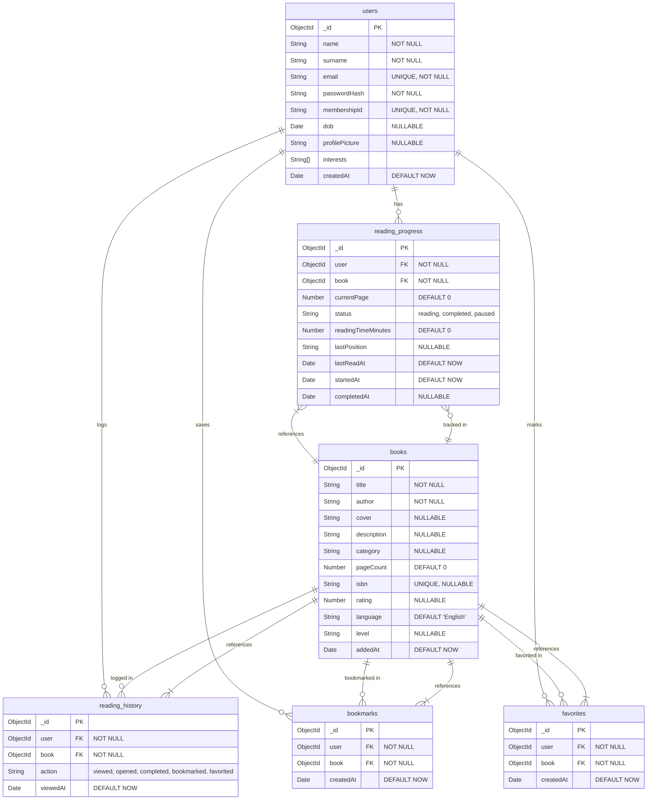
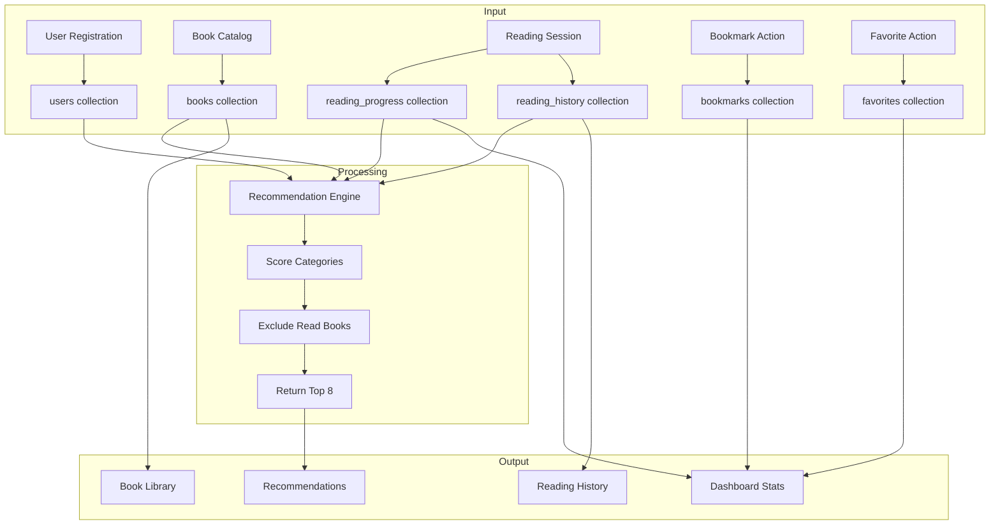

# LEARNOVA - Data Model

## 1. Entity Diagram


```mermaid
erDiagram
    users {
        ObjectId _id PK
        String name "NOT NULL"
        String surname "NOT NULL"
        String email "UNIQUE, NOT NULL"
        String passwordHash "NOT NULL"
        String membershipId "UNIQUE, NOT NULL"
        Date dob "NULLABLE"
        String profilePicture "NULLABLE"
        String[] interests
        Date createdAt "DEFAULT NOW"
    }

    books {
        ObjectId _id PK
        String title "NOT NULL"
        String author "NOT NULL"
        String cover "NULLABLE"
        String description "NULLABLE"
        String category "NULLABLE"
        Number pageCount "DEFAULT 0"
        String isbn "UNIQUE, NULLABLE"
        Number rating "NULLABLE"
        String language "DEFAULT 'English'"
        String level "NULLABLE"
        Date addedAt "DEFAULT NOW"
    }

    reading_progress {
        ObjectId _id PK
        ObjectId user FK "NOT NULL"
        ObjectId book FK "NOT NULL"
        Number currentPage "DEFAULT 0"
        String status "reading, completed, paused"
        Number readingTimeMinutes "DEFAULT 0"
        String lastPosition "NULLABLE"
        Date lastReadAt "DEFAULT NOW"
        Date startedAt "DEFAULT NOW"
        Date completedAt "NULLABLE"
    }

    reading_history {
        ObjectId _id PK
        ObjectId user FK "NOT NULL"
        ObjectId book FK "NOT NULL"
        String action "viewed, opened, completed, bookmarked, favorited"
        Date viewedAt "DEFAULT NOW"
    }

    bookmarks {
        ObjectId _id PK
        ObjectId user FK "NOT NULL"
        ObjectId book FK "NOT NULL"
        Date createdAt "DEFAULT NOW"
    }

    favorites {
        ObjectId _id PK
        ObjectId user FK "NOT NULL"
        ObjectId book FK "NOT NULL"
        Date createdAt "DEFAULT NOW"
    }

    users ||--o{ reading_progress : "has"
    users ||--o{ reading_history : "logs"
    users ||--o{ bookmarks : "saves"
    users ||--o{ favorites : "marks"

    books ||--o{ reading_progress : "tracked in"
    books ||--o{ reading_history : "logged in"
    books ||--o{ bookmarks : "bookmarked in"
    books ||--o{ favorites : "favorited in"

    reading_progress }|--|| books : "references"
    reading_history }|--|| books : "references"
    bookmarks }|--|| books : "references"
    favorites }|--|| books : "references"
```

---

## 2. Collection Relationships

### 2.1 Relationship Matrix

| Collection 1 | Collection 2 | Relationship | Cardinality | Reference Field | Cascade |
|--------------|--------------|--------------|-------------|-----------------|---------|
| users | reading_progress | One-to-Many | 1:N | user | Manual delete |
| users | reading_history | One-to-Many | 1:N | user | Manual delete |
| users | bookmarks | One-to-Many | 1:N | user | Manual delete |
| users | favorites | One-to-Many | 1:N | user | Manual delete |
| books | reading_progress | One-to-Many | 1:N | book | Manual delete |
| books | reading_history | One-to-Many | 1:N | book | Manual delete |
| books | bookmarks | One-to-Many | 1:N | book | Manual delete |
| books | favorites | One-to-Many | 1:N | book | Manual delete |

### 2.2 Junction Collections

| Collection | Links | Unique Index | Purpose |
|------------|-------|--------------|---------|
| reading_progress | users + books | (user, book) | One progress record per user-book pair |
| reading_history | users + books | None (append-only) | Event log of all reading actions |
| bookmarks | users + books | (user, book) | One bookmark per user-book pair |
| favorites | users + books | (user, book) | One favorite per user-book pair |

> References are stored as `ObjectId` fields and resolved with Mongoose `populate()`. There are no DB-level foreign keys; the application deletes dependent documents when a user or book is removed.

---

## 3. Collection Descriptions

### 3.1 users

The central collection storing registered user accounts (model: `backend/models/User.js`).

| Field | Type | Constraints | Description |
|-------|------|-------------|-------------|
| _id | ObjectId | PK | Unique user identifier |
| name | String | NOT NULL | User's first name |
| surname | String | NOT NULL | User's last name |
| email | String | UNIQUE, NOT NULL | Login email, stored lowercase |
| passwordHash | String | NOT NULL | bcrypt hashed password |
| membershipId | String | UNIQUE, NOT NULL | Format: LRN-YYYY-XXXXXX |
| dob | Date | NULLABLE | Date of birth |
| profilePicture | String | NULLABLE | URL to profile image |
| interests | String[] | default [] | Array of category strings |
| createdAt | Date | DEFAULT NOW | Account creation timestamp |

### 3.2 books

The book catalog available in the library (model: `backend/models/Book.js`).

| Field | Type | Constraints | Description |
|-------|------|-------------|-------------|
| _id | ObjectId | PK | Unique book identifier |
| title | String | NOT NULL | Book title |
| author | String | NOT NULL | Author name |
| cover | String | NULLABLE | Cover image URL |
| description | String | NULLABLE | Book summary |
| category | String | NULLABLE | One of 8 categories |
| pageCount | Number | DEFAULT 0 | Total pages |
| isbn | String | UNIQUE (sparse), NULLABLE | ISBN identifier |
| rating | Number | NULLABLE | Rating 0.0-9.9 |
| language | String | DEFAULT 'English' | Book language |
| level | String | NULLABLE | Beginner/Intermediate/Advanced |
| addedAt | Date | DEFAULT NOW | When book was added |

### 3.3 reading_progress

Tracks each user's progress on books they're reading (model: `backend/models/ReadingProgress.js`).

| Field | Type | Constraints | Description |
|-------|------|-------------|-------------|
| _id | ObjectId | PK | Unique record identifier |
| user | ObjectId | ref users | Reference to user |
| book | ObjectId | ref books | Reference to book |
| currentPage | Number | DEFAULT 0 | Last read page |
| status | String | enum | reading/completed/paused |
| readingTimeMinutes | Number | DEFAULT 0 | Cumulative reading time |
| lastPosition | String | NULLABLE | Bookmark position |
| lastReadAt | Date | DEFAULT NOW | Last reading session |
| startedAt | Date | DEFAULT NOW | When reading started |
| completedAt | Date | NULLABLE | When book was finished |

### 3.4 reading_history

Append-only log of all user-book interactions (model: `backend/models/ReadingHistory.js`).

| Field | Type | Constraints | Description |
|-------|------|-------------|-------------|
| _id | ObjectId | PK | Unique event identifier |
| user | ObjectId | ref users | Reference to user |
| book | ObjectId | ref books | Reference to book |
| action | String | enum | viewed/opened/completed/bookmarked/favorited |
| viewedAt | Date | DEFAULT NOW | When action occurred |

### 3.5 bookmarks

Users' saved books for later reading (model: `backend/models/Bookmark.js`).

| Field | Type | Constraints | Description |
|-------|------|-------------|-------------|
| _id | ObjectId | PK | Unique bookmark identifier |
| user | ObjectId | ref users | Reference to user |
| book | ObjectId | ref books | Reference to book |
| createdAt | Date | DEFAULT NOW | When bookmark was created |

### 3.6 favorites

Users' favorite books (model: `backend/models/Favorite.js`).

| Field | Type | Constraints | Description |
|-------|------|-------------|-------------|
| _id | ObjectId | PK | Unique favorite identifier |
| user | ObjectId | ref users | Reference to user |
| book | ObjectId | ref books | Reference to book |
| createdAt | Date | DEFAULT NOW | When favorite was created |

---

## 4. Indexes

### 4.1 Primary Keys

Every collection uses the default `_id` ObjectId primary key.

### 4.2 Unique Indexes

| Collection | Field(s) | Purpose |
|------------|----------|---------|
| users | email | uq_users_email |
| users | membershipId | uq_users_membership |
| books | isbn | uq_books_isbn (sparse) |
| reading_progress | user, book | uq_progress_user_book |
| bookmarks | user, book | uq_bookmark_user_book |
| favorites | user, book | uq_favorite_user_book |

### 4.3 Regular Indexes

| Collection | Field(s) | Purpose |
|------------|----------|---------|
| reading_progress | user, status | Filter by user and status |
| reading_history | user, viewedAt | Sort history by date |

---

## 5. Seed Data Summary

### 5.1 Book Categories

| Category | Count | Examples |
|----------|-------|----------|
| Computer Science | 6 | Clean Code, Designing Data-Intensive Applications |
| Data Science | 4 | Python for Data Analysis, Hands-On Machine Learning |
| Design | 3 | The Design of Everyday Things, Don't Make Me Think |
| Business & Economics | 4 | The Lean Startup, Zero to One |
| Literature | 4 | To Kill a Mockingbird, 1984 |
| History | 3 | Sapiens, Guns Germs and Steel |
| Science | 3 | A Brief History of Time, Cosmos |
| Self-Development | 3 | Atomic Habits, Deep Work |
| **Total** | **30** | |

Seed via `npm run db:init` (or the `db-init` Docker service) which upserts books by ISBN and is safe to re-run.

### 5.2 Membership ID Format

```
LRN-YYYY-XXXXXX
│    │    │
│    │    └── 6-character alphanumeric (excluding I, O, 0, 1)
│    └── Year of registration
└── Fixed prefix
```

Example: `LRN-2026-A3B7K2`

---

## 6. Default Values

| Collection | Field | Default |
|------------|-------|---------|
| books | pageCount | 0 |
| books | language | 'English' |
| reading_progress | currentPage | 0 |
| reading_progress | status | 'reading' |
| reading_progress | readingTimeMinutes | 0 |
| reading_history | action | 'viewed' |

---

## 7. Data Flow Diagram


```mermaid
flowchart TD
    subgraph Input
        A[User Registration] --> B[users collection]
        C[Book Catalog] --> D[books collection]
        E[Reading Session] --> F[reading_progress collection]
        E --> G[reading_history collection]
        H[Bookmark Action] --> I[bookmarks collection]
        J[Favorite Action] --> K[favorites collection]
    end

    subgraph Processing
        L[Recommendation Engine] --> M[Score Categories]
        M --> N[Exclude Read Books]
        N --> O[Return Top 8]
    end

    subgraph Output
        P[Dashboard Stats]
        Q[Reading History]
        R[Recommendations]
        S[Book Library]
    end

    B --> L
    D --> L
    F --> L
    G --> L
    I --> P
    K --> P
    F --> P
    G --> Q
    O --> R
    D --> S
```