# LEARNOVA - System Flowcharts

## 1. User Registration Flow

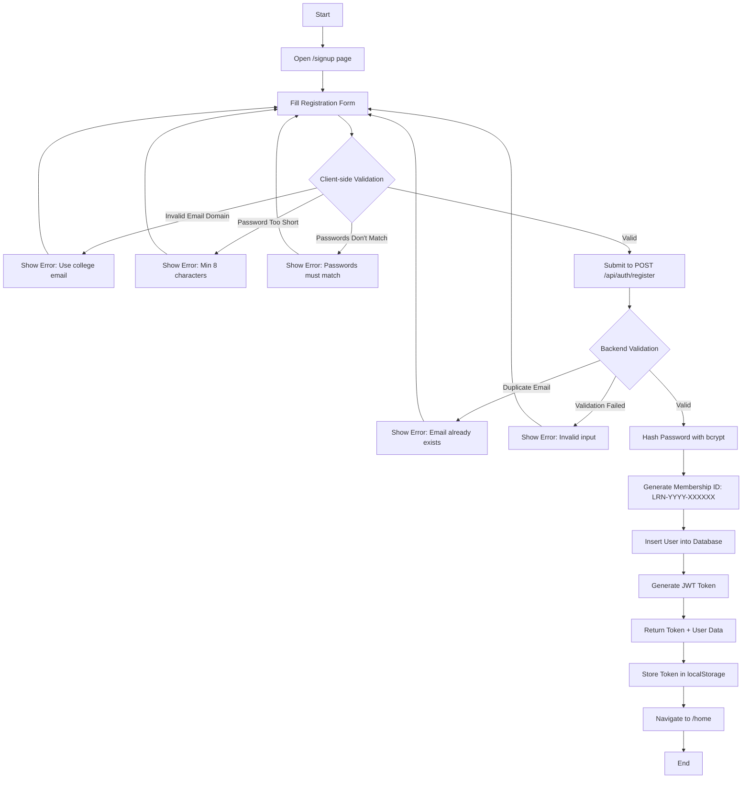

---

## 2. User Login Flow

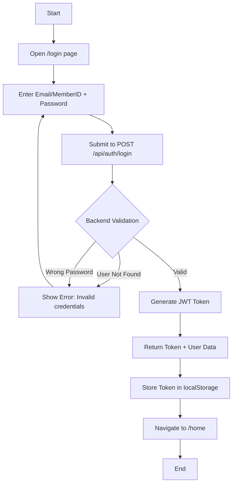

---

## 3. Authentication & Authorization Flow

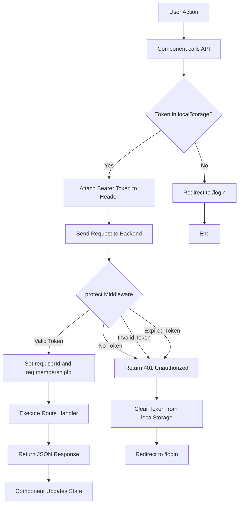

---

## 4. Book Browsing & Search Flow

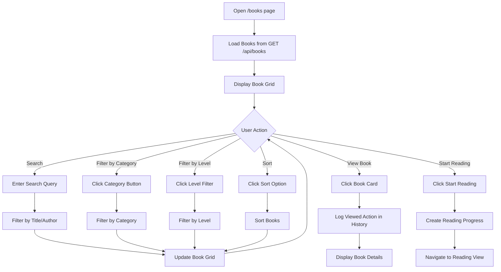

---

## 5. Reading Progress Tracking Flow

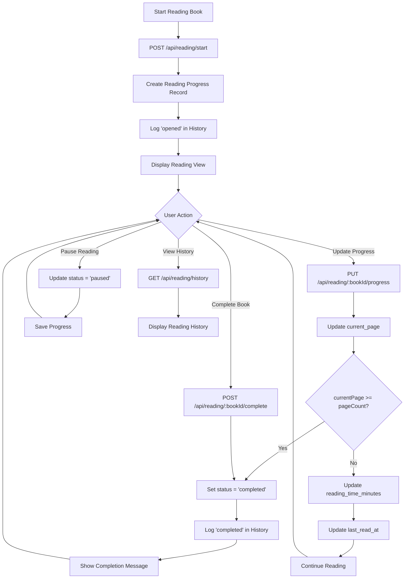

---

## 6. Bookmark & Favorite Flow

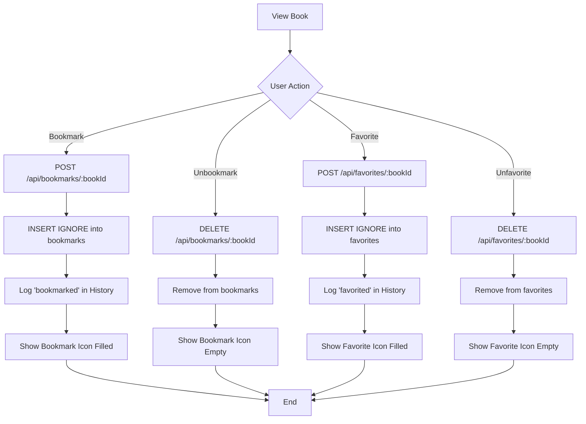

---

## 7. Dashboard Statistics Flow

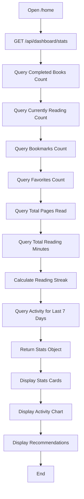

---

## 8. Recommendation Engine Flow

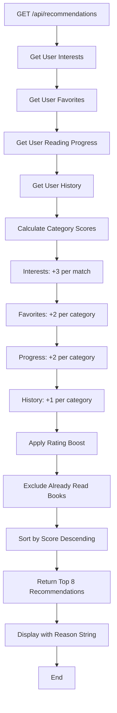

---

## 9. Complete System Architecture Flow

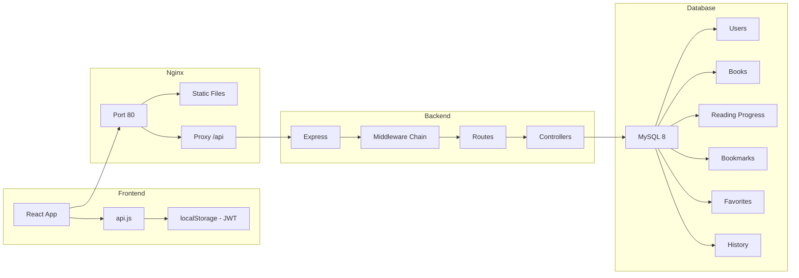

---

## 10. Docker Deployment Flow

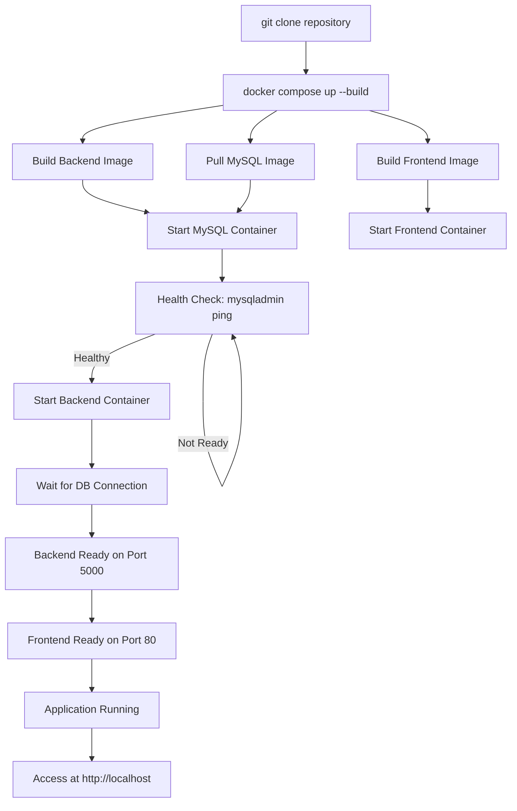

---

## 11. Data Flow Summary

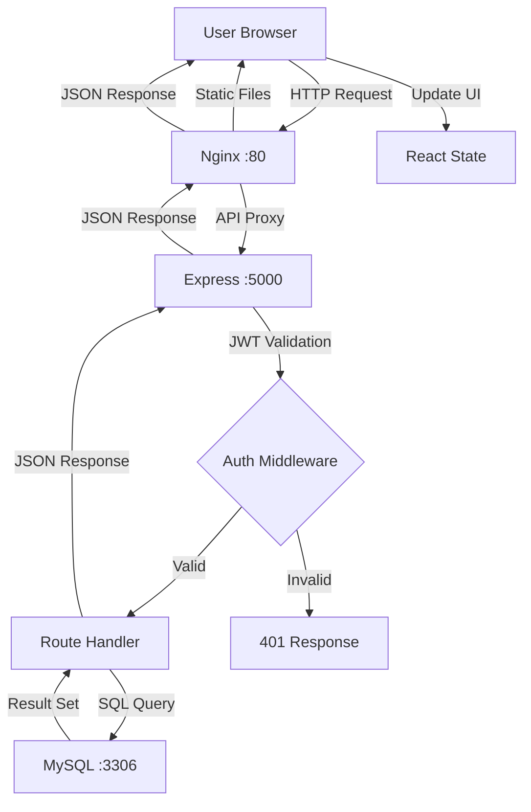
